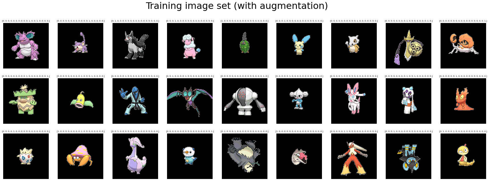
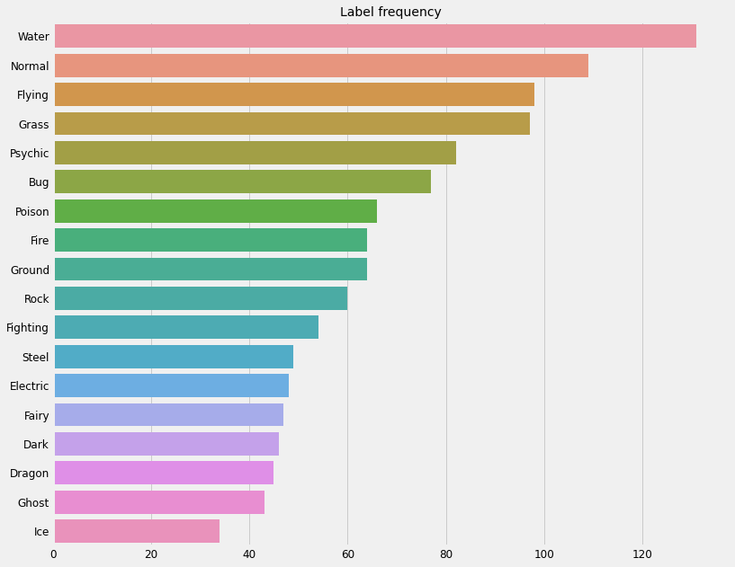

# pokemon-types

>Gotta batch 'em all!   

Predicting the type of a pokemon given an image of it using a deep convolutional neural network.  Each pokemon has either 1 or 2 types, so this is a multi-label classification problem.  Our total dataset includes pokemon images from generation 1 to 7.  There are ~800 total sample points.   
 
The dataset comes from [kaggle](https://www.kaggle.com/vishalsubbiah/pokemon-images-and-types).  

**training batch sample** 



**prediction on test set**
 
 


### Points of interest 

**Imbalanced dataset**  
There is a huge imbalance in the target variable.  For example, there are approximately five times as many instances of a water type pokemon than an ice type pokemon.  



A solution to this could be to adjust sampling to adjust for this--either undersample or oversample such that the target variables are roughly equal.  Since our goal is for the model to capture visual features that are indicators of a pokemon's type, this will be fine.  


**Small dataset**  
Our dataset is only 800 samples.  This is very teeny tiny for a deep learning application.  Image augmentation can help with this. 

 
**Mutli-label classification**  
This is a mutli-label classification problem because each sample can be of one or two types.  So obviously, we cannot use categorical crossentropy loss here.  We will explore applying pair-wise binary crossentropy and explore other clever loss functions.  We can develop our own heuristic loss function by applying some knowledge we have about the target domain.  For example, misclassifying a point as Water when it is Ice is wrong, but it is more correct than misclassfying it as fire.  We can encode this into a tensorflow-ready loss function and will likely see improvement in learning.  

**Transfer learning**  
Let's try to apply some transfer learning from some tensorflow model that was trained on ImageNet or something.  I intend on freezing the transfer learned layers and applying a simple dense layer architecture on top of it.  


## Data Preprocessing 
Data preprocessing is done in the `01-munge-data.ipynb`.  

## Model Building 
The model in `02-model-building.ipynb` performs the best out of all iterations.   

### Network Architecture 
The best performing model is a deep convolutional neural network.  There are five conv/pool layers and batch normalization is used as a regularizing agent.  

```python
model = tf.keras.Sequential([
    Conv2D(16, (3, 3), activation='relu', input_shape=(IMG_HEIGHT, IMG_WIDTH, CHANNELS)), 
    BatchNormalization(), 
    MaxPooling2D((2, 2)),   
    
    Conv2D(32, (3, 3), activation='relu'), 
    BatchNormalization(), 
    MaxPooling2D((2, 2)), 
    
    Conv2D(64, (3, 3), activation='relu'), 
    BatchNormalization(), 
    MaxPooling2D((2, 2)), 

    Conv2D(128, (3, 3), activation='relu'), 
    BatchNormalization(), 
    MaxPooling2D((2, 2)), 
    
    Conv2D(150, (3, 3), activation='relu'), 
    BatchNormalization(), 
    MaxPooling2D((2, 2)), 
    
    Flatten(), 
    Dense(64, activation='relu'), 
    Dense(N_LABELS), 
])
```

### Image Augmentation 
Image augmentation was applied since our dataset was relatively small for deep learning.  The augmented data pointed are randomly subjected to rotations and flips along the horizontal and vertical axes.  


### Transfer Learning 
MobileNetV2 was used for transfer learning in `04-model-building-transferlearn.ipynb`.  The model performs worse than our crafted one because it overfit too easily.  This could be counteracted by letting the transfer learned layers train for a bit and applying dropout or batch norm.    